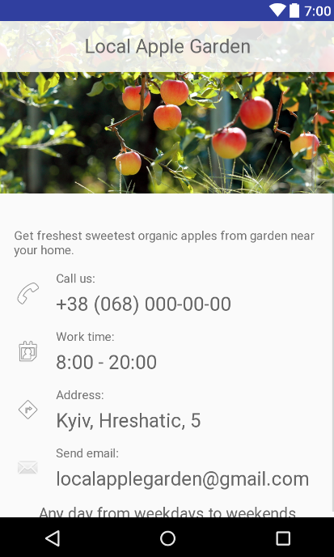

# Business Card

Second task from Udacity's [Android basics course](https://www.udacity.com/course/android-basics-nanodegree-by-google--nd803)

Android Basics: User Interface

[Lesson 5: Project](https://review.udacity.com/#!/rubrics/133/view)

An app for a fictional business "Local Apple Garden"

Only _call us_ line is clickable. It opens implicit DIAL intent.
